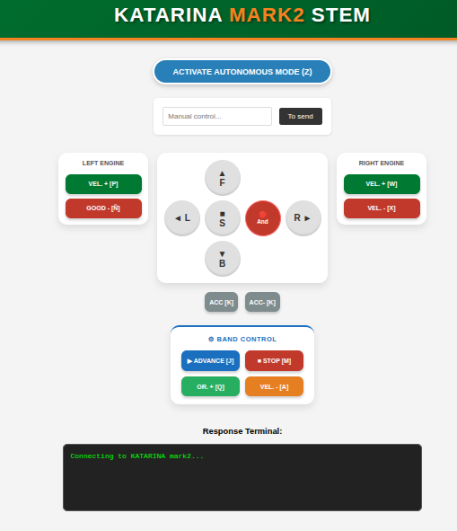

# 🤖 KATA-bot: Autonomous Waste Collection Robot

**KATA-bot** is an advanced autonomous robotics platform developed for the **Mexican Robotics Tournament (TMR)** in the "Beach Can Collection" category. This project integrates real-time computer vision, robust embedded systems architecture, and wireless telemetry to solve environmental cleanup challenges.

---

## 📸 Project Gallery

### Hardware & Development
| Photo 1: General Prototype | Photo 2: Electronics & Chassis |
|---|---|
|  |  |
| **Photo 3: Field Testing** | **Photo 4: Engineering Team** |
|  |  |

### 📹 Technical Demos
Watch KATA-bot in action:

#### 1. Autonomous Navigation & Pathfinding
|  |  |

#### 2. Computer Vision Pipeline (OpenCV Detection)

---

## 🛠️ Technical Specifications

* **Computer Vision:** Real-time processing on **Raspberry Pi 4** using OpenCV for target detection through HSV color filtering and contour analysis.
* **Embedded Architecture:** Robust dual-unit system using **ESP32 MCUs** with opto-isolators for driver protection and relay-based power management for high-torque motors.
* **Web-Based Control:** Custom **WebSocket-based HTML interface** hosted locally on the ESP32, enabling real-time manual override and telemetry.
* **Remote Monitoring:** Established wireless remote access via **VNC/SSH** for system debugging and live camera feed visualization.
* **Power Systems:** Managed high-current DC motor draws with a custom-engineered electronic safety layer.

## ⚠️ Competition & Confidentiality Notice
Please note that the **source code and firmware are currently private** due to our upcoming participation in the **Mexican Robotics Tournament (TMR)** on **April 16th, 2026**. To maintain competition integrity and team confidentiality, the files will be made public shortly after the tournament concludes.

## 👥 Leadership & Management
As **Project Lead**, I managed a multidisciplinary team of 12 engineers. My role focused on technical roadmapping, cross-departmental integration (Mechanics, Electronics, and Software), and rapid prototyping for the 2025 and 2026 competition cycles.

## 🚀 Repository Status
* **Documentation:** ✅ Available
* **Hardware Assets:** ✅ Available
* **Source Code:** 🔒 Restricted until April 17th, 2026

---

## 👨‍💻 About the Author
**Francisco Viveros Mendoza**
*B.S. in Robotics and Telecommunications Engineering - UDLAP*
[LinkedIn](https://www.linkedin.com/in/francisco-viveros-mendoza-a20a06328/) | [GitHub](https://github.com/paco-vive) | [Portfolio](https://urbanos.vercel.app/)
